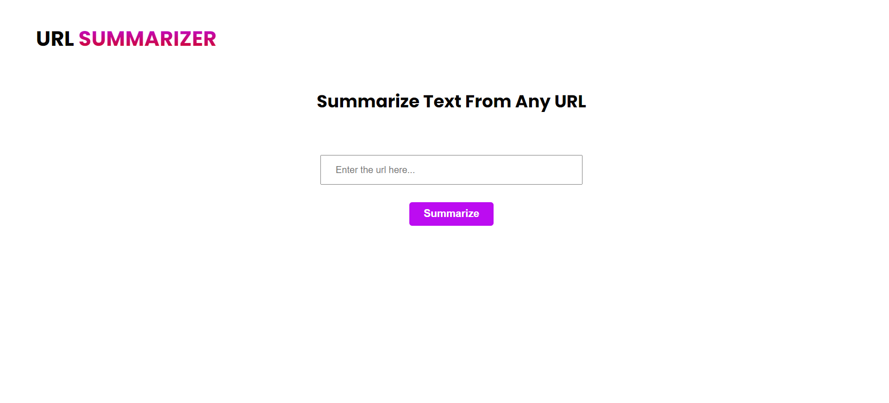

# URL Summarization Project

This project provides a web application for summarizing the content of a given URL. It utilizes React for the frontend, Express with TypeScript for the backend, and integrates OpenAI API for summarization and Puppeteer for web scraping with Browserless for headless browsing.

# Screenshot

<p align="center">
  
</p>

## Features

- Web scraping to extract content from a given URL using Puppeteer with Browserless.
- Summarization of extracted content using OpenAI API.
- React-based frontend for user interaction.
- Express server with TypeScript for backend implementation.

## Live Demo

Explore the live demo [here](https://url-summarizer.netlify.app/).

## Getting Started

### Prerequisites

Before running the project, make sure you have the following installed:

- [Node.js](https://nodejs.org/)
- [npm](https://www.npmjs.com/)
- [Browserless](https://www.browserless.io/) account for Puppeteer.

### Installation

1. Clone the repository:

   ```bash
   git clone https://github.com/your-username/url-summarization-project.git
   ```

2. Install dependencies for both the frontend and backend:

   ```bash
   cd url-summarization-project
   cd client && npm install
   cd ../server && npm install
   ```

### Configuration

1. Set up environment variables:
   Create a .env file in the server directory and add the following:

   ```bash
   BLESS_TOKEN=your_browserless_token
   OPENAI_API_KEY=your_openai_api_key
   CORS_ORIGIN=your_frontend_url
   ```

### Running the Application

1. Start the backend server:
   ```bash
   cd server && npm start
   ```
2. Start the frontend:
   ```bash
   cd client && npm start
   ```
3. Visit http://localhost:5173 in your browser to access the application.

### Usage

1. Enter a URL in the input field.
2. Click the "Summarize" button.
3. The application will extract the content from the URL, summarize it using OpenAI, and display the result.
